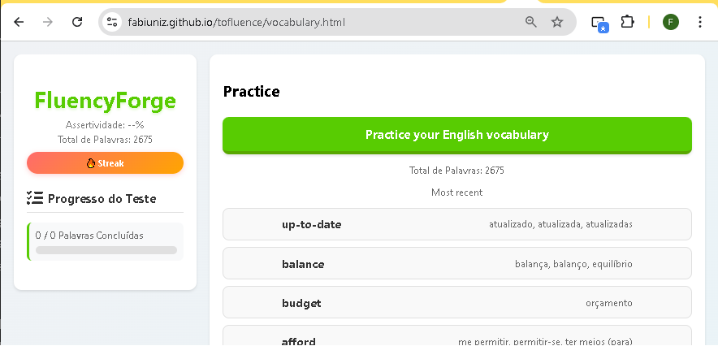

<!-- 
  Tags: Skils
  Label: 🗣️ Pratice Vocabulary
  Description: Pratice Vocabulary - Ferramenta de Potencialização de Vocabulário Inglês
  path_hook: hookfigma.hook17
-->

---

# 🚀 Projeto: Pratice Vocabulary - Ferramenta de Potencialização de Vocabulário

---

## Visão Geral

Este projeto, **Pratice Vocabulary**, é uma aplicação web simples, mas eficaz, desenvolvida para potencializar a aquisição de **vocabulário em inglês**. A ferramenta centraliza-se em uma **lista de palavras específicas que o usuário precisa reforçar**, servindo como um complemento poderoso a um método de estudo mais abrangente. Inspirado em plataformas populares de aprendizado de idiomas, o Pratice Vocabulary oferece um ambiente focado na prática de vocabulário ativo e passivo, fundamental para o desenvolvimento da fluência. **Futuramente, essa lista de palavras será persistida e gerenciada via Google Sheets**, garantindo flexibilidade e colaboração.

Como Analista de Sistemas, concebi e implementei esta ferramenta para resolver uma dor pessoal de aprendizado, aplicando princípios de design de interface intuitivo (**UI**) e experiência do usuário (**UX**), além de demonstrar minhas habilidades em desenvolvimento **front-end**.

---

## 💡 A Fundamentação: Teoria por Trás do Aprendizado

Minha jornada no aprendizado de inglês me levou a aprofundar em teorias de aquisição de idiomas. O Pratice Vocabulary é uma materialização dessas descobertas, focando em como o cérebro absorve um novo idioma de forma mais eficiente, **especialmente ao focar em vocabulário direcionado para reforço**:

### Repetição e Exposição Contínua: A Base da Memorização

Acredito firmemente que a **exposição contínua e a repetição espaçada são as chaves para a memorização e internalização do vocabulário**. O Pratice Vocabulary foi desenhado para facilitar essa repetição, permitindo que o cérebro absorva as palavras de forma intuitiva, quase como uma aquisição natural, em vez de um aprendizado formal e estático. A prática constante das palavras da nossa lista alvo fortalece as conexões neurais, tornando o vocabulário mais acessível e automático.

### Input Compreensível Direcionado

Esta teoria sugere que o aprendizado ocorre de forma mais eficaz quando o conteúdo é majoritariamente compreendido, com apenas pequenos desafios para estimular o avanço. No Pratice Vocabulary, isso se aplica ao **foco na lista de palavras que o usuário já identificou como áreas a serem reforçadas**. O teste de correspondência é projetado para apresentar essas palavras em um nível que estimule o reconhecimento e a associação, mantendo o usuário engajado sem sobrecarga cognitiva.

### O Papel do Filtro Afetivo na Prática de Vocabulário

Um ambiente positivo e livre do medo de errar reduz as barreiras na aprendizagem. A interface clara e os **feedbacks visuais imediatos** no teste do Pratice Vocabulary visam criar uma experiência de baixo estresse, incentivando a prática contínua das palavras-alvo sem a pressão da performance perfeita. Isso é crucial para que o usuário se sinta confortável em revisar e errar, promovendo um aprendizado mais eficaz.

### Prática Ativa vs. Passiva para Consolidação

Embora o princípio do "monitor de fala" seja focado na produção, ele se adapta ao vocabulário: a prática espontânea e a revisão ativa são cruciais. O Pratice Vocabulary oferece um modo de "prática" onde você pode revisitar o vocabulário da sua lista, permitindo que as palavras sejam absorvidas de forma mais fluida. O modo "teste" é reservado para uma correção mais focada e para verificar a consolidação do aprendizado das palavras selecionadas.

### Ordem Natural e Controle do Usuário

Respeitar o ritmo ideal do aprendizado, avançando gradualmente do simples ao complexo, garante a consolidação do conteúdo. O Pratice Vocabulary, ao **permitir ao usuário adicionar e organizar o vocabulário em sua lista pessoal (futuramente no Google Sheets)**, dá a ele controle total sobre essa progressão, adaptando-se ao seu ritmo individual e priorizando as palavras que realmente precisam de reforço.

---

## 🎯 Objetivo do Projeto

O objetivo principal do Pratice Vocabulary é:

* **Reforçar o aprendizado de vocabulário específico**: Oferecer uma ferramenta prática para memorizar e revisar uma lista de palavras que o usuário precisa dominar, agindo como um "músculo" para as bases do idioma.
* **Demonstrar proficiência técnica**: Exibir minhas habilidades em desenvolvimento front-end (**HTML**, **CSS**, **JavaScript**), manipulação do **DOM** e lógica de programação.
* **Aplicar princípios de UX/UI**: Criar uma interface intuitiva e responsiva que otimize a experiência do usuário com foco na prática direcionada.
* **Preparar para a imersão**: Construir uma base sólida do vocabulário *essencial* para que a imersão em cenários reais seja realmente eficaz e transformadora em fluência.
* **Implementar persistência de dados com Google Sheets**: Desenvolver a integração para que a lista de vocabulário seja gerenciada externamente, permitindo fácil edição e acesso.

---

## 💻 Aspectos Técnicos e Implementação

O Pratice Vocabulary é construído com **tecnologias web padrão**, garantindo acessibilidade e facilidade de implantação:

* **HTML5**: Estruturação semântica do conteúdo da página.
* **CSS3**: Estilização responsiva, inspirada na interface do Duolingo, garantindo uma experiência visual agradável em diferentes dispositivos (desktops, tablets e celulares).
* **Media Queries**: Implementadas para adaptar o layout e o tamanho dos elementos a diversas resoluções de tela.
* **JavaScript**:
    * **Manipulação do DOM**: Dinamiza a interface, permitindo a exibição de cards de vocabulário e o controle da lógica do jogo de correspondência.
    * **Lógica do Jogo**: Gerenciamento do estado do teste (seleções, correspondências corretas/incorretas, feedback), embaralhamento das palavras e transição entre os conjuntos.
    * **Controle de Progresso**: Atualização de barra de progresso e cálculo de assertividade em tempo real.
    * **Modularização**: O vocabulário é carregado de um arquivo `vocabulary.js` separado, facilitando a manutenção e expansão da base de palavras **(futuramente, essa carga será feita a partir do Google Sheets)**.

### Desafios e Soluções:

Um desafio chave foi garantir que o mecanismo de correspondência de palavras fosse robusto, especialmente com traduções que poderiam ser idênticas para palavras em inglês diferentes. A solução envolveu:

* **`dataset` HTML**: Cada botão armazena não apenas o texto exibido, mas também a palavra em inglês à qual ele realmente corresponde (`data-original-word` para inglês, `data-correct-english-word` para português).
* **Lógica de Comparação**: A validação é feita comparando esses atributos `dataset`, garantindo um pareamento preciso, mesmo em casos de traduções idênticas para palavras diferentes.
* **Controle de Estado**: Utilização de variáveis para `selectedEnglishWordButton` e `selectedPortugueseTranslationButton`, além de um `Set` (`matchedEnglishWordsInCurrentSet`) para rastrear as palavras já correspondidas em cada rodada de teste, evitando cliques duplicados ou inconsistências.

---

## 📊 Demonstração e Funcionalidades

Você pode interagir com o Pratice Vocabulary diretamente clicando [aqui para experimentar](/vocabulary.html).
As principais funcionalidades incluem:

* **Listagem de Vocabulário**: Visualização paginada das palavras e suas traduções **(da lista definida para reforço)**.
* **Modo de Prática (Match the Words)**:
    * Um jogo interativo de correspondência onde você associa palavras em inglês às suas traduções em português.
    * **Feedback Visual**: Cores e animações indicam acertos e erros.
    * **Progresso em Tempo Real**: Barra de progresso e contagem de assertividade atualizadas dinamicamente.
    * **Reinício de Teste**: Opção para recomeçar o teste a qualquer momento.

---

## 🔮 Próximos Passos e Melhorias Futuras

O Pratice Vocabulary é um projeto em constante evolução. Futuras melhorias planejadas incluem:

* **Gerenciamento de Vocabulário com Google Sheets**: Integração com a API do Google Sheets para que os usuários possam adicionar, editar e remover palavras de sua lista diretamente, permitindo uma gestão centralizada e eficiente do vocabulário a ser reforçado.
* **Diferentes Tipos de Exercícios**: Implementação de exercícios de preenchimento de lacunas, escrita, escuta, etc., sempre focados nas palavras da lista do usuário.
* **Persistência de Dados (Local Storage/Google Sheets)**: Salvar o progresso do usuário e as palavras marcadas para revisão.
* **Categorização/Níveis**: Organização do vocabulário por temas ou níveis de dificuldade, facilitando a seleção de subconjuntos da lista principal.
* **Áudio**: Adicionar pronúncia para as palavras.

---

## 🔗 Código e Contribuições

O código-fonte completo está disponível no meu repositório GitHub: [Link para o seu repositório GitHub do projeto]
Sinta-se à vontade para explorar, sugerir melhorias ou até mesmo contribuir!

---

## 👨‍💻 Autor

**Fabiano Rocha/Fabiuniz**

---

## Licença

Este projeto está licenciado sob a [MIT License](LICENSE).

---